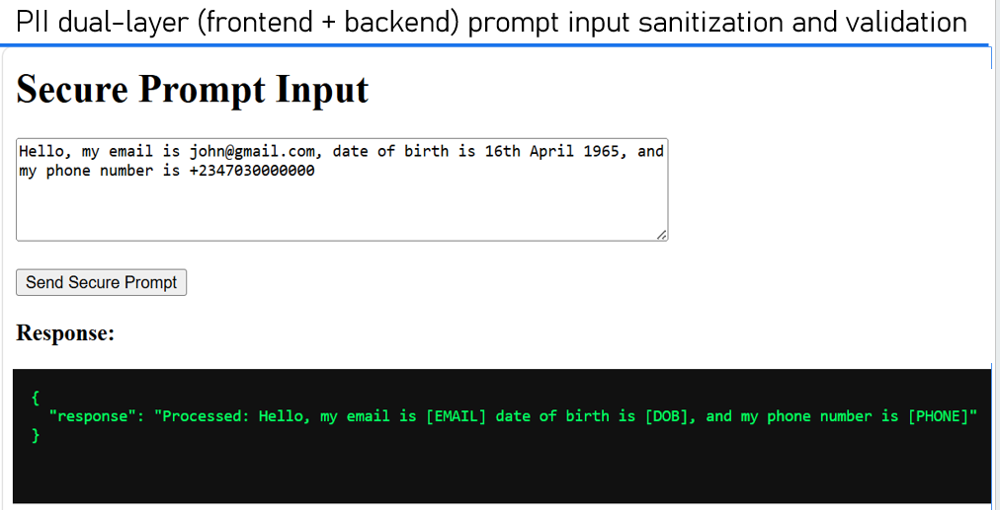
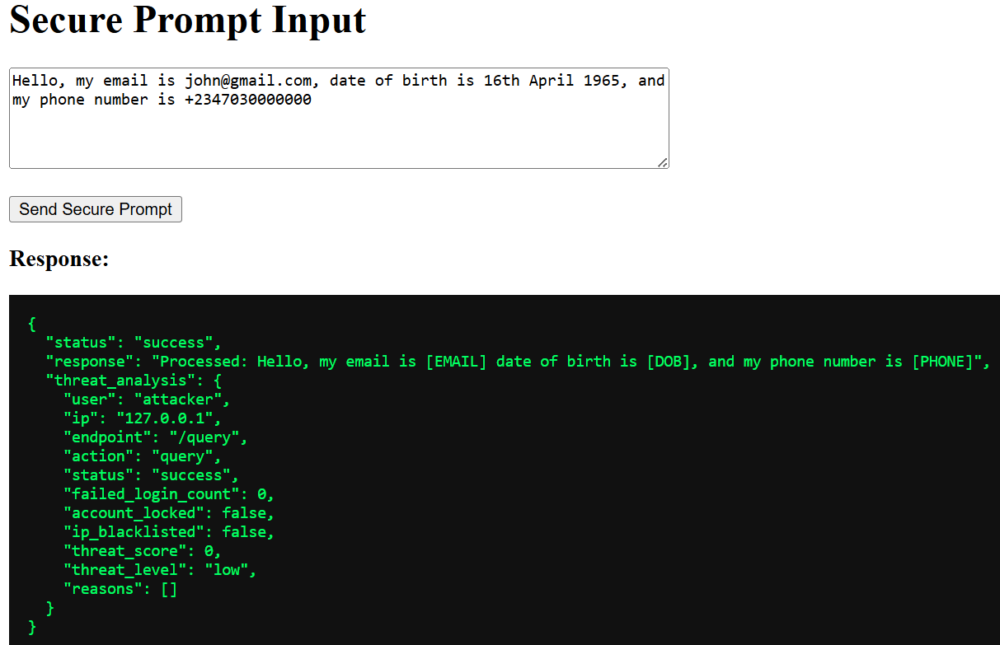
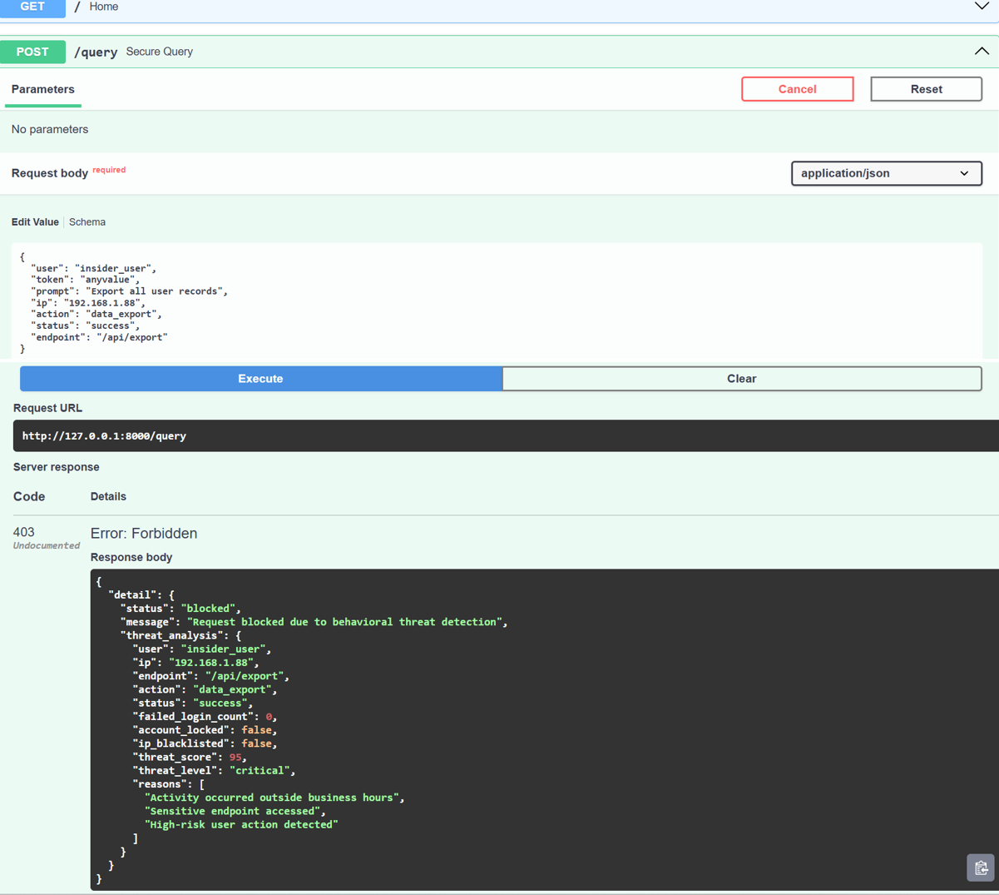
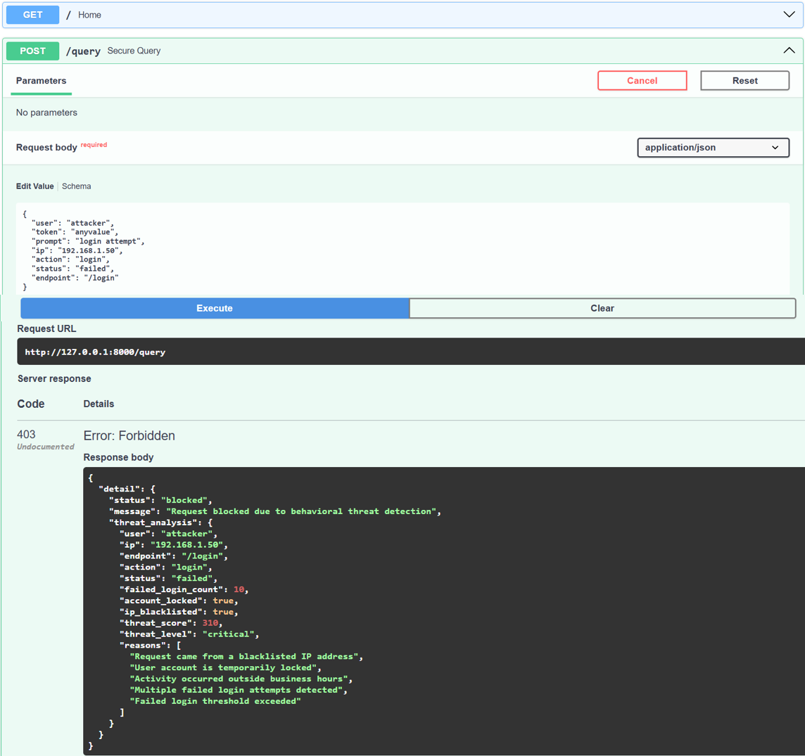
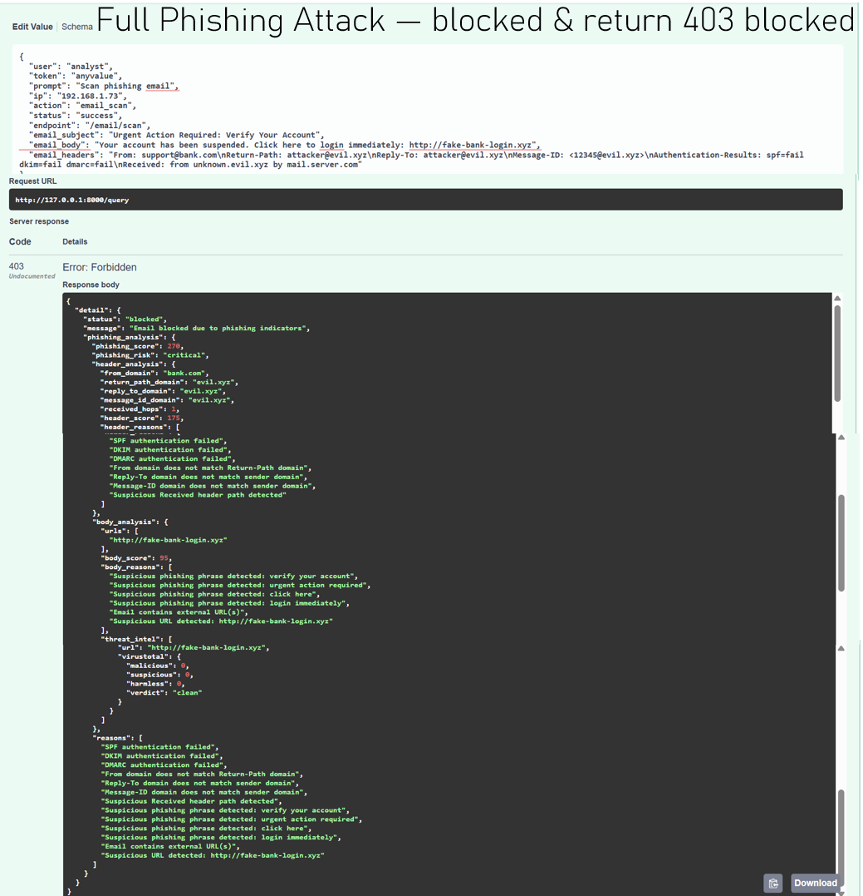
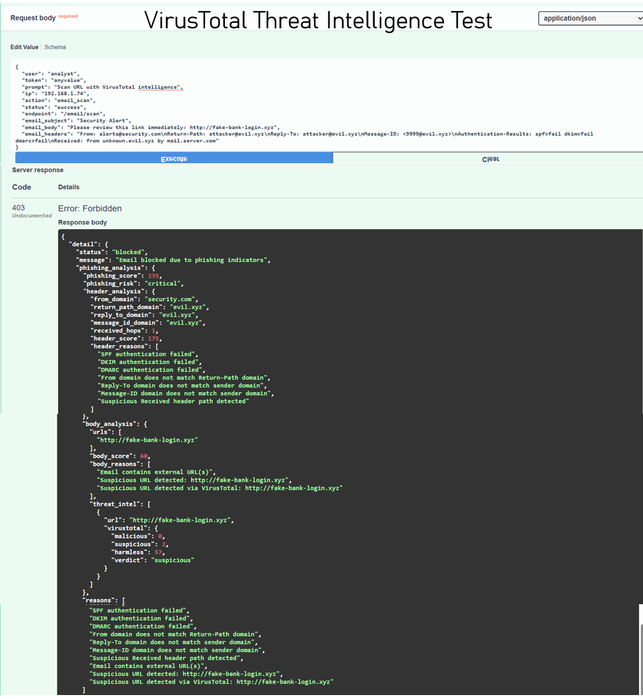

# 🔐 🚀 AI Security Middleware with Behavioral Threat Detection & Phishing Defense

🚨 A production-style AI security system that simulates how a **Security Operations Center (SOC)** detects, analyzes, and blocks cyber threats in real time.

---

## 👤 Author  
**Louis Okperiruisi**  
Cybersecurity Analyst | SOC | AI Security | Detection Engineering  

---

## 📌 Overview

This project implements a **defense-in-depth AI security system** designed to protect modern applications from evolving cyber threats.

It integrates multiple security layers to detect and respond to:

- Prompt injection attacks  
- Sensitive data (PII) exposure  
- Behavioral anomalies  
- Brute-force login attempts  
- Insider threats  
- **Phishing email attacks (header + content analysis + threat intelligence)**  

The system combines **frontend + backend protections**, behavioral analytics, and automated response mechanisms to enforce a **zero-trust security model**.

---

## 📸 Screenshots

### 🔹 Secure Frontend Input (PII Masking)

---

### 🔹 API Response with Sanitized Data

---

### 🔹 Behavioral Threat Detection Output

---

### 🔹 Blocked Malicious Request (403)

---

### 🔹 Phishing Email Detection (Blocked)

---

### 🔹 VirusTotal Threat Intelligence

---

## 🧠 Key Features

### 🔐 Multi-Layer Security Architecture

- Authentication validation  
- Rate limiting enforcement  
- Prompt injection detection  
- PII sanitization (client + server)  
- Behavioral threat scoring  
- **Phishing email detection (header + content analysis)**  
- **VirusTotal threat intelligence integration**  
- Secure logging  

---

## 📧 Phishing Email Detection & Response

This module simulates how modern SOC teams detect phishing threats using **multi-layer analysis**.

### 🧠 Header Analysis
- SPF, DKIM, DMARC validation  
- Sender spoofing detection (From vs Return-Path mismatch)  
- Reply-To manipulation detection  
- Suspicious mail routing (Received headers)  

### 📩 Content Analysis
- Social engineering keyword detection  
- Credential harvesting indicators  
- Suspicious URL extraction  

### 🌍 Threat Intelligence Integration
- URLs are analyzed using **VirusTotal API**  
- Detects:
  - Malicious links  
  - Suspicious domains  
  - Known threat indicators  

### 🚫 Automated Response
- High-risk emails are automatically blocked (HTTP 403)  
- Security events are logged for further investigation  

---

## 🧾 PII Protection (Defense-in-Depth)

| Layer | Description |
|------|------------|
| Frontend | Masks PII before sending request |
| Backend | Re-validates and sanitizes input |
| Logging | Prevents raw PII exposure |

**Detected PII:**
- Emails → `[EMAIL]`  
- Phone numbers → `[PHONE]`  
- Date of Birth → `[DOB]`  

---

## 🧠 Behavioral Threat Detection

The system evaluates user activity using:

- Failed login patterns  
- IP anomalies  
- After-hours access  
- Sensitive endpoint usage  
- High-risk actions (e.g. data export, privilege escalation)  

### 🚨 Threat Levels
Low → Medium → High → Critical  

### 🔒 Automated Actions
- Account lockout  
- IP blacklisting  
- Request blocking (403)  

---

## 🔄 System Workflow
